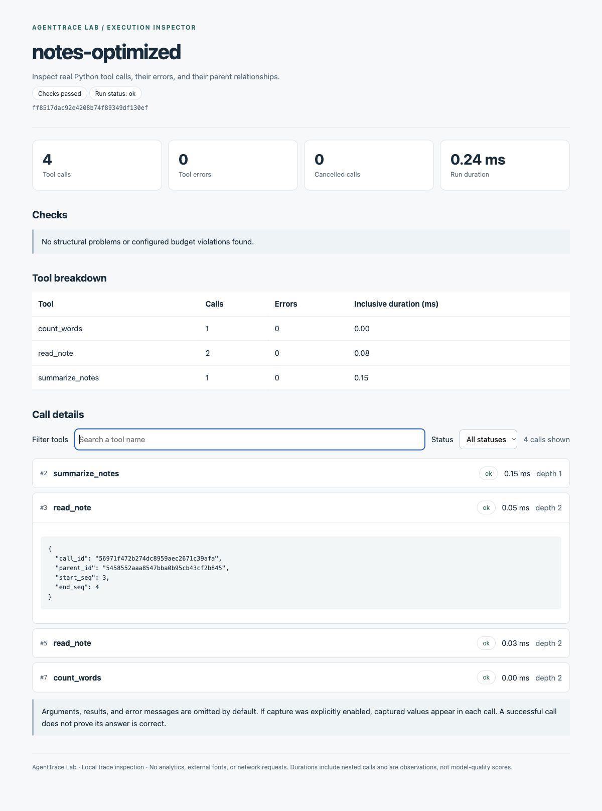

# AgentTrace Lab

**See what your agent's Python tools actually did — and catch regressions before shipping.**

Record real sync/async function calls, inspect their parent relationships, and compare runs in CI. Portable HTML reports, Python 3.9+, no runtime dependencies, no account or model key required.

[中文学习路线](docs/LEARNING_PATH.zh-CN.md) · [Trace format](docs/TRACE_FORMAT.md) · [Contributing](CONTRIBUTING.md)

## Why this exists

After changing an agent, it may call a tool twice, swallow an exception, or spend more time in a nested operation. A final answer alone does not show what happened. This project gives you a local record to inspect and compare without sending it to a hosted service.

This is a tool-observability utility, not an autonomous agent or an LLM benchmark. It does not score answer quality, infer token costs, prevent duplicate side effects, or stop running tools. Budgets are **post-run checks**.

## Try it

From the repository root:

```bash
python3 -m agent_trace_lab demo --output artifacts/demo
```

Open `artifacts/demo/candidate/report.html`. Filter by tool name or status and expand a call to inspect its IDs, parent, and available captured data.

The demo executes actual file reads over two example notes. Its baseline deliberately reads one note twice; the candidate removes that extra read. A third run records a handled `FileNotFoundError`. This controlled example demonstrates the library, not improved model performance.



Example report from a local demo run. Your run IDs and timings will differ.

```bash
# Check a recorded run against explicit budgets.
python3 -m agent_trace_lab inspect artifacts/demo/candidate.jsonl \
  --max-calls 4 --max-errors 0 --output artifacts/inspection

# Candidate has one fewer call: passes.
python3 -m agent_trace_lab compare artifacts/demo/baseline.jsonl \
  artifacts/demo/candidate.jsonl --output artifacts/comparison

# Reverse the comparison: an extra call causes exit code 1.
python3 -m agent_trace_lab compare artifacts/demo/candidate.jsonl \
  artifacts/demo/baseline.jsonl --output artifacts/regression
```

On Windows, use `python` if that is your interpreter command. Demo and report commands replace generated files in their output directory; input traces are protected from report-path collisions.

## Add it to your own tools

Install into your application's virtual environment from this checkout:

```bash
python3 -m pip install .
```

Instrument a normal Python function:

```python
from pathlib import Path
from agent_trace_lab import TraceSession

with TraceSession("my-run.jsonl", name="notes-agent") as trace:
    @trace.tool()
    def read_note(path: str) -> str:
        return Path(path).read_text(encoding="utf-8")

    text = read_note("README.md")
```

```bash
agent-trace inspect my-run.jsonl --output artifacts/my-run
```

The decorator also supports `async def`, nested calls, and thread-safe event writes. Return objects and original exceptions are preserved. Await or join all calls inside the session. Generator functions are unsupported because iteration requires a different lifecycle.

Use a new trace filename for each run, or explicitly set `overwrite=True`. Create the parent directory first. Instrument functions your agent actually invokes; the decorator does not make model calls or alter planning behavior.

## What you can inspect

| Capability | Recorded or checked behavior |
| --- | --- |
| Actual execution timing | Per-call and whole-run durations measured with a monotonic clock |
| Sync and async tools | Success, errors, cancellation, and nested parent IDs |
| Structural audit | Missing ends, reused IDs, orphan events, invalid sequences, mixed runs, and parent cycles |
| Explicit budgets | Maximum calls, errors, or total duration; violations produce a failing exit code |
| Run comparison | Count/error changes and optional duration-ratio checks |
| Portable reports | Filterable HTML and machine-readable JSON, without remote resources |

Durations include nested calls; do not sum them as exclusive CPU time. Plain threads do not automatically inherit parent context. Async context follows Python's `contextvars` behavior.

## Privacy and failure behavior

Arguments, results, and exception messages are **omitted by default**. Run/tool names, error types, timestamps, and execution metadata are recorded; choose names safe for your intended audience.

Use the boolean `capture_values=True` only when you want bounded value summaries. Common credential keys/patterns are masked, but this is not a general secret or personal-data detector. Review captures before sharing them.

Opening a trace file can raise normally. If writing fails after recording starts, the library warns, stops recording, and preserves the tool's result or exception. Check `trace.logging_errors`; a partial recording is not a complete run. See the [format and lifecycle contract](docs/TRACE_FORMAT.md).

## CLI contract

| Command | Purpose |
| --- | --- |
| `demo --output DIR` | Record local file-call examples and generate reports |
| `inspect TRACE --output DIR` | Audit one v1 JSONL run |
| `compare BEFORE AFTER --output DIR` | Compare two v1 runs |
| `run --output DIR` | Retained v0.1 synthetic executor lessons, using a separate format |

`inspect` accepts `--max-calls`, `--max-errors`, and `--max-duration-ms`. Handled tool errors are measurements until an error budget is set. Failed application runs and incomplete/corrupted traces fail their audit.

`compare` allows no extra calls or errors by default. Configure `--max-extra-calls` or `--max-extra-errors` when needed. Duration checks are opt-in with `--max-duration-ratio`; use the same inputs and account for timing noise.

Exit codes: `0` = checks passed or demo generated; `1` = checks/regression failed; `2` = invalid input or I/O. Output directories contain `report.html` and `report.json`.

Import supports this project's documented v1 JSONL format, one run per file. Vendor traces need adapters. Input limits are 1 MiB per line and 20 MiB per file, with strict UTF-8 and finite JSON values. The old `run` command emits a separate synthetic format; use `demo` for v1 recordings.

## Verification and code map

```bash
python3 -m unittest discover -s tests -v
python3 -m agent_trace_lab demo --output artifacts/demo
```

Tests cover real I/O, async/threaded/nested calls, exception identity, cancellation, capture defaults, corrupted traces, input limits, HTML escaping, and CLI exit codes. GitHub Actions is configured for Python 3.9 and 3.13; check repository run results before assuming hosted CI passed.

| Area | Code |
| --- | --- |
| Recorder | `agent_trace_lab/tracing.py` |
| Audit and comparison | `agent_trace_lab/audit.py` |
| HTML reports | `agent_trace_lab/inspector.py` |
| Real-call demonstration | `agent_trace_lab/demo.py` |
| Synthetic executor lessons | `engine.py`, `runner.py`, `scenarios.py`; [guide](docs/SYNTHETIC_LAB.md) |

The [learning path](docs/LEARNING_PATH.zh-CN.md) connects this work to OpenAI Agents SDK, LangGraph, MCP, and Inspect AI through concrete exercises. These integrations are planned, not existing compatibility claims. Small reproducible bugs, documented failure traces, and focused optional adapters are welcome.

## 中文简介

给自己的 Python 工具函数加上 `@trace.tool()`，记录真实耗时、异常和嵌套关系；生成本地交互报告，检查调用次数与错误预算，并比较修改前后的运行。默认不采集参数和结果，无需模型密钥。

首个目标是让 Agent 执行问题可复现、可解释。先接入你自己的一个工具，再尝试 MCP 服务或 Agent 框架的事件适配。多模态证据追踪和真实模型集成属于后续工作。

## License

MIT. See [LICENSE](LICENSE).
