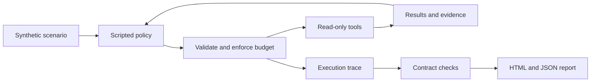

# AgentTrace Lab

**What happens when an agent calls the wrong tool, retries too often, or loses its evidence?**

A small, inspectable Python lab for testing the execution layer around tool-using agents. Run a synthetic failure suite, inspect every request, and open an HTML report. No API key, GPU, or third-party runtime dependency is required.

> Version 0.1 uses a **scripted policy** and a **synthetic corpus**. It evaluates executor behavior, not LLM intelligence. Timeout faults are injected exceptions; no wall-clock timeout or real-model benchmark is claimed.

## Run in under a minute

Requires Python 3.9 or later. From a fresh checkout:

```bash
git clone https://github.com/chzFRA/agent-trace-lab.git
cd agent-trace-lab
python3 -m agent_trace_lab run --output artifacts
python3 -m unittest discover -s tests -v
```

Open `artifacts/report.html` in your browser. Machine-readable results are in `artifacts/report.json`; each recorded tool request is a line in `artifacts/traces.jsonl`. Running again replaces these generated files.

On Windows, use `python` instead of `python3` if that is your Python command.

## What it demonstrates

| Capability | Observable behavior |
| --- | --- |
| Tool and argument validation | Unknown tools and invalid arguments never dispatch a handler |
| Bounded execution | Every admitted request counts toward the call budget, including invalid requests |
| Duplicate request protection | Reusing a call ID is rejected without running the tool again |
| Failure recovery | A transient failure can be retried with a fresh ID, within both retry and call limits |
| Evidence provenance | Extracted answers carry citation IDs from successful document reads |
| Trace inspection | Requests, outcomes, dispatch decisions, faults, and remaining budget can be inspected |



The two built-in tools are `search_docs` and `read_document`. The first performs lexical retrieval over a tiny in-memory corpus; the second returns source paragraphs with citation IDs. The retrieval policy extracts the first paragraph from the highest-ranked matching document. This is deliberately simple so the executor's decisions remain visible.

## Failure suite

| Scenario | Expected result |
| --- | --- |
| Grounded answer | Return a source paragraph and its citation |
| Transient recovery | Recover from one injected read failure |
| Missing evidence | Abstain when the search has no matches |
| Invalid arguments | Reject a non-string query |
| Unknown tool | Reject an unregistered tool |
| Budget exhausted | Stop before a read that exceeds the budget |
| Duplicate call ID | Reject the second request without dispatch |
| Retry limit | Stop when the permitted retry also fails |

**Read the metrics separately:** passing a scenario means the expected behavior occurred. An intentional rejection or exhausted budget can therefore pass the scenario while failing to answer the retrieval task. The report keeps these counts separate. Citation grounding checks exact provenance, not whether an answer is semantically sufficient.

## Customize a scenario

Save this as `recovery.json` in your checkout:

```json
{
  "id": "custom-recovery",
  "description": "Recover from one document-read failure",
  "mode": "retrieve",
  "query": "deployment test suite rollback checkpoint",
  "max_calls": 4,
  "max_retries": 1,
  "transient_failures": {"read_document": 1},
  "expect": {
    "outcome": "answered",
    "statuses": ["transient_error", "success"],
    "citations": ["doc:deployment#p1"]
  }
}
```

```bash
python3 -m agent_trace_lab run --scenario recovery.json --output artifacts/custom
```

`retrieve` mode runs the scripted search/read policy. `probe` mode accepts explicit `calls`, each with `call_id`, `tool`, and `arguments`; see `agent_trace_lab/scenarios.py` for examples. Scenario files are declarative JSON, capped at 1 MiB, with bounded call and retry counts. `expect.statuses` checks that the listed statuses occur, not their order or multiplicity.

Exit codes: `0` means all expected-behavior checks passed, `1` means at least one failed, and `2` means the input or output operation was invalid.

## Code map

| File | Responsibility |
| --- | --- |
| `agent_trace_lab/engine.py` | Tool handlers, validation, duplicate detection, budgets, and trace events |
| `agent_trace_lab/scenarios.py` | Synthetic cases and custom-scenario validation |
| `agent_trace_lab/runner.py` | Scripted policy, retry decisions, contract checks, and metric aggregation |
| `agent_trace_lab/report.py` | JSON, JSONL, and escaped HTML reports |
| `tests/` | Offline executor, scenario, report, and CLI contract tests |

## Scope and next experiments

This is an educational engineering baseline. It has no external tool execution, autonomous planner, persistent memory, parallel execution, or multimodal model. Duplicate protection is limited to a single executor instance. The included source text is synthetic and is not legal or operational advice.

Potential next steps, **not implemented in this version**:

- Add a real model policy adapter and compare it with the scripted baseline using the same trace format.
- Add independent answer-quality labels, adversarial cases, and trace replay validation.
- Add PDF page-image evidence and evaluate page-level citations separately from answer quality.
- Add real tool deadlines and cancellation before connecting network or side-effecting tools.

## 中文简介

这是一个用于检查 Agent 工具执行过程的小型工程项目：覆盖参数校验、调用预算、重复请求拒绝、失败重试和证据引用，并生成可查看的轨迹与报告。首版使用规则策略和合成案例，无需模型密钥。案例通过率代表执行行为符合预期，不代表大模型回答准确率。多模态、真实模型接入和真实超时控制是后续扩展方向。

## License

MIT. See [LICENSE](../LICENSE).
