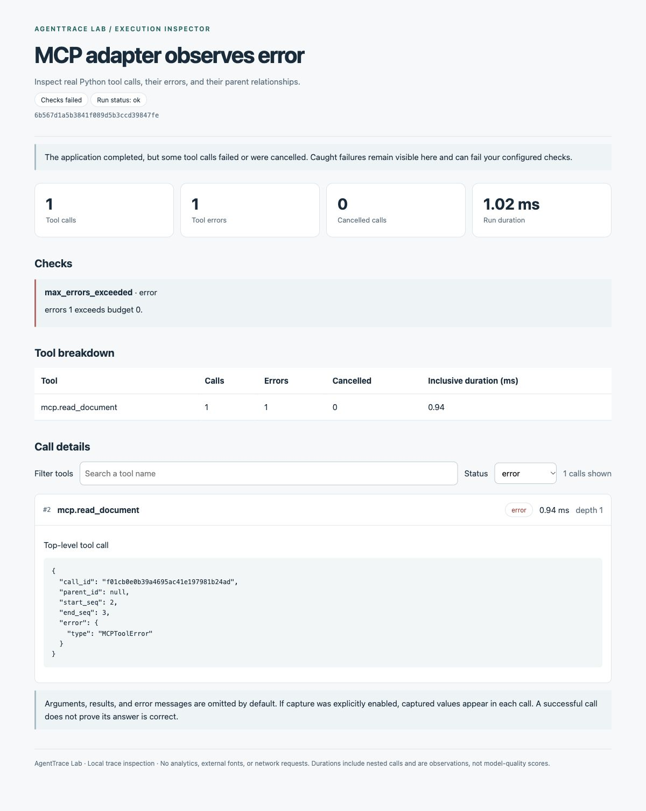

# What has actually been validated

Local validation on 2026-10-01 (Pacific/Auckland), for version 0.3.0.
This is an evidence record for a small Python developer tool. It does not claim
external-user adoption, a production-readiness audit, or improved LLM answers.

## A concrete problem the tool now helps diagnose

An MCP server can return `isError=true` without the Python client raising an
exception. A plain function-call tracer then reports a successful Python return,
even though the MCP tool failed. The real [stdio example](../examples/mcp_document_search/README.md)
reproduces both sides of that boundary with the official SDK:

| Same missing-file request | Python execution | Recorded tool errors | Zero-error budget |
| --- | --- | --- | --- |
| Raw SDK call | Returns an MCP error result normally | 0 | Passes, missing the semantic failure |
| Explicit adapter | Checks the flag and raises `MCPToolError` inside the traced function | 1 | Fails as intended |

The adapter solves this specific integration mismatch. AgentTrace Lab's generic
decorator remains exception-based; it cannot infer arbitrary business failures
from return values. A caller may catch the adapter error and recover while the
trace still retains the failed tool invocation.



The report above comes from the recorded acceptance run. Its application status
is `ok` because the example catches the exception, while the failed tool and
zero-error budget remain visible. Browser checks confirmed status filtering,
call expansion, and the named-tool comparison table.

The same integration searches and reads actual files in a separate server
process. A controlled extra read changes recorded calls from 2 to 3, and the
comparison CLI returns `1`. An empty search remains successful. A separate search
against this repository's `docs` finds the `run_start` schema documentation with
a file path and line number. No LLM, mocked RPC, or provider credential is used.

## Reproducible checks

| Verification | Observed local result | Reproduce |
| --- | --- | --- |
| Core suite | 76 tests passed on Python 3.9.6 | `python3 -m unittest discover -s tests -v` |
| Real MCP integration | 28 acceptance assertions passed on Python 3.12.14 / `mcp==2.2.0` | Follow the [example setup](../examples/mcp_document_search/README.md#run-the-acceptance-checks) |
| Real project-doc search | Found the schema table in `TRACE_FORMAT.md` | Run the example's `search run_start --root docs` command |
| Package/first-use checks | A separate review agent installed 0.3.0 into a new Python 3.12 venv from a clean source copy; outside the checkout, demo, own-file instrumentation, inspect and compare succeeded; another new venv passed all 28 MCP checks | [Chinese tutorial](QUICKSTART.zh-CN.md) |
| Hosted CI | Core Python 3.9/3.13 and optional MCP Python 3.12 jobs are configured | Check the [actual Actions runs](https://github.com/chzFRA/agent-trace-lab/actions), rather than treating this file as a live status |

The 76 tests include retained synthetic-executor lessons; they are not 76 real
Agent/user scenarios. The MCP assertions inspect returned evidence, discovered
schemas, actual error flags, generated traces, and CLI exit codes. Expected
negative results are deliberate: a regression must fail its check for acceptance
to pass. [Saved MCP acceptance evidence](evidence/mcp-acceptance.json) redacts only
the local report directory from CLI output.

## Problems found and corrected during this review

- **Hidden tool changes:** total errors could remain unchanged while one tool
  started failing and another recovered. Reports now show named-tool changes;
  `compare --per-tool` applies tolerances to each tool as well as totals.
- **Cancellation blind spot:** comparisons now check increased cancellations;
  `inspect --max-cancelled 0` rejects a caught cancellation when that is the policy.
- **Initialization diagnostics:** cleanup failure no longer replaces the original
  failure to create the recording.
- **Recorder/reader mismatch:** 45,000 tiny calls previously generated about
  22.6 MB with an apparently successful run, exceeding the 20 MiB reader limit.
  The recorder now stops before the shared size limit, emits a diagnostic, and
  preserves tool execution. The remaining partial trace fails completeness checks.
- **Untrusted imports:** impossible durations, content fields contradicting
  disabled capture, invalid Unicode, and over-32-level JSON are rejected.
- **Usability:** expanded calls name their parent tool; comparisons identify the
  tools that changed. The CLI and HTML agree about whether per-tool checks ran.

Focused regressions exercise concurrent nesting, cancellation, early context
exit, partial writes, flush/close failures, and original exception/return identity.
A close failure after a successful flush is visible in `trace.logging_errors`,
but may not be inferable from the final file. Applications must check that property.

## Measured cost of recording

Command, from the repository root:

```bash
python3 tools/measure_overhead.py --calls 1000 --delayed-calls 200 --delay-ms 1 --repeats 5 --output artifacts/overhead.json
```

Observed on macOS arm64 / Python 3.9.6, five repetitions, median microseconds per call:

| Workload | No tracing | Default tracing | Value capture enabled |
| --- | ---: | ---: | ---: |
| Tiny identity function | 0.033 | 15.929 | 29.025 |
| Function using `sleep(1ms)` | 1,258.227 | 1,360.800 | 1,420.445 |

Default and captured recordings were approximately 508 and 668 bytes per call
for the tiny-function payload. [Raw aggregate measurements and source hashes](evidence/overhead-macos-python39.json)
include all samples. Per-call measurements include serialization, synchronous
write and flush, but exclude session setup/close and report generation. `flush`
does not provide `fsync` durability. Waiting samples include OS scheduling noise.
These are local observations, not speed promises or timing gates in CI.

This supports a narrow recommendation: instrument meaningful I/O/tool operations,
not every operation in a tight loop. Measure your own payload and filesystem.
Use one bounded session per task; there is no rotation or cross-process trace merge.

## What remains unproven

- Whether external developers save debugging time compared with their existing logs.
- General compatibility with every MCP server, SDK version, streaming tool, or Agent framework.
- Long-running production operation, distributed tracing, or high-throughput behavior.
- Correctness of model answers, semantic retrieval quality, token usage, or monetary savings.

The current release is suitable for trying local Python tool diagnostics and the
documented MCP integration. Users can reproduce a concrete fault, see its trace,
apply the demonstrated adapter, and make a regression check fail automatically.
The next evidence should come from actual integrations and issue reports, rather
than adding more claims to the README.
